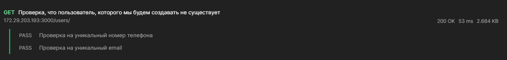
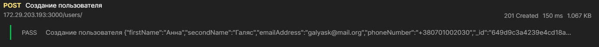
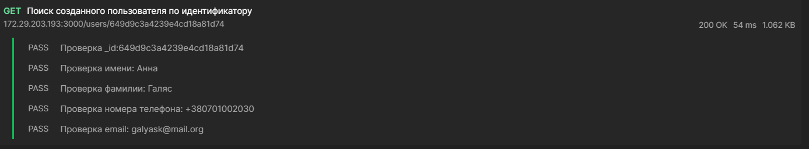
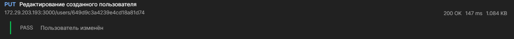
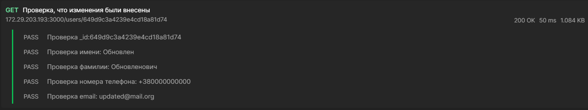
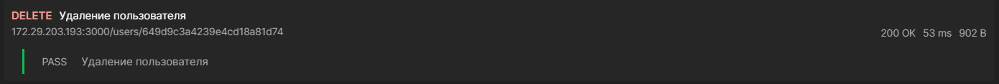
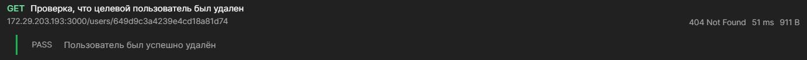

# 1. Проверка, что тестовый пользователь не использует уже зарегистрированные номер телефона или email адрес:

> 

_Pre-request Script:_

```js
const iteratedUser = pm.iterationData.get('USER')
pm.environment.set('USER', JSON.stringify(iteratedUser))
pm.environment.set(`Testing`, true)
```

_Main script:_

```js
const jsonData = pm.response.json()
const testUser = JSON.parse(pm.environment.get(`USER`))

pm.test('Проверка на уникальный номер телефона', function () {
    let phoneValidation = true

    for (user of jsonData) {
        if (user.phoneNumber == testUser.phoneNumber) {
            phoneValidation = false

            pm.environment.set('Testing', false)
            pm.expect(
                phoneValidation,
                'Этот пользователь будет использовать  уже зарезервированные в системе данные, обновите {phoneNumber} пользователя и повторите попытку'
            ).to.be.true
        }
    }
})

if (testUser.emailAddress) {
    pm.test('Проверка на уникальный email ', function () {
        let emailValidation = true

        for (user of jsonData) {
            if (user.emailAddress == testUser.emailAddress) {
                emailValidation = false
                pm.environment.set('Testing', false)
                pm.expect(
                    emailValidation,
                    'Этот пользователь будет использовать  уже зарезервированные в системе данные, обновите {emailAddress} пользователя и повторите попытку'
                ).to.be.true
            }
        }
    })
}
```

# 2. Создание тестового пользователя:

> 

_Pre-request script:_

```js
if (pm.environment.get('Testing')) {
    let testUser = JSON.parse(pm.environment.get(`USER`))

    pm.request.headers.add({
        key: 'Content-Type',
        value: 'application/json',
    })

    pm.request.body = {
        mode: 'raw',
        raw: {
            firstName: testUser.firstName,
            secondName: testUser.secondName,
            phoneNumber: testUser.phoneNumber,
            emailAddress: testUser.emailAddress,
        },
    }
} else {
    throw new Error(
        'Пользователь которого вы пытаетесь создать не прошёл проверку на уникальный {emailAddress} или {phoneNumber}'
    )
}
```

_Main script:_

```js
const createdUser = pm.response.json()
const curId = createdUser._id
pm.environment.set('testUserId', curId)

pm.test(`Создание пользователя ${JSON.stringify(createdUser)} :`, () => {
    if (pm.response.code !== 201) {
        pm.environment.set('Testing', false)
    }
    pm.expect(pm.response.code).to.equal(201)
})
```

# 3. Поиск созданного пользователя по идентификатору

> 

_Pre-request:_

```js
if (!pm.environment.get('Testing')) {
    throw new Error('Пользователь не прошел регистрацию')
}
```

_Tests:_

```js
const resUser = pm.response.json()
const testUser = JSON.parse(pm.environment.get(`USER`))

pm.test(`Проверка _id:${pm.environment.get('testUserId')}`, function () {
    let idCheck = false

    if (resUser._id === pm.environment.get('testUserId')) {
        idCheck = true
    }

    pm.expect(
        idCheck,
        '{_id} пользователя, который был найден, не совпадает с данными обновлённого пользователя'
    ).to.be.true
})

pm.test(`Проверка имени: ${testUser.firstName}`, function () {
    let firstNameCheck = false

    if (resUser.firstName === testUser.firstName) {
        firstNameCheck = true
    }

    pm.expect(
        firstNameCheck,
        '{fisrtName} пользователя, который был найден, не совпадает с данными обновлённого пользователя'
    ).to.be.true
})
pm.test(`Проверка фамилии: ${testUser.secondName}`, function () {
    let secondNameCheck = false

    if (resUser.secondName === testUser.secondName) {
        secondNameCheck = true
    }

    pm.expect(
        secondNameCheck,
        '{secondName} пользователя, который был найден, не совпадает с данными обновлённого пользователя'
    ).to.be.true
})
pm.test(`Проверка номера телефона: ${testUser.phoneNumber}`, function () {
    let phoneNumberCheck = false

    if (resUser.phoneNumber === testUser.phoneNumber) {
        phoneNumberCheck = true
    }

    pm.expect(
        phoneNumberCheck,
        '{phoneNumber} пользователя, который был найден, не совпадает с данными обновлённого пользователя'
    ).to.be.true
})

if (testUser.emailAddress) {
    pm.test(`Проверка email: ${testUser.emailAddress}`, function () {
        let emailAddressCheck = false

        if (resUser.emailAddress === testUser.emailAddress) {
            emailAddressCheck = true
        }

        pm.expect(
            emailAddressCheck,
            '{emailAddress} пользователя, который был найден, не совпадает с данными обновлённого пользователя'
        ).to.be.true
    })
}
```





